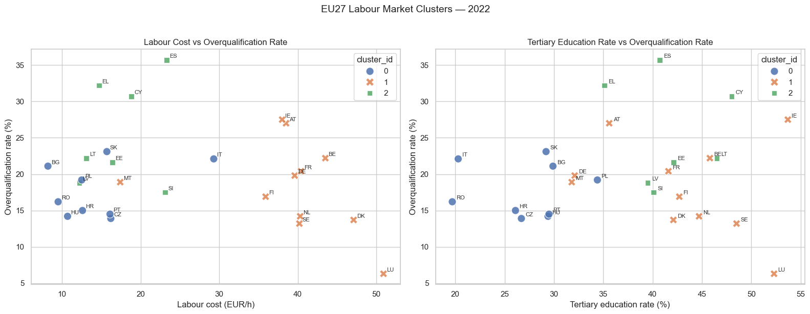
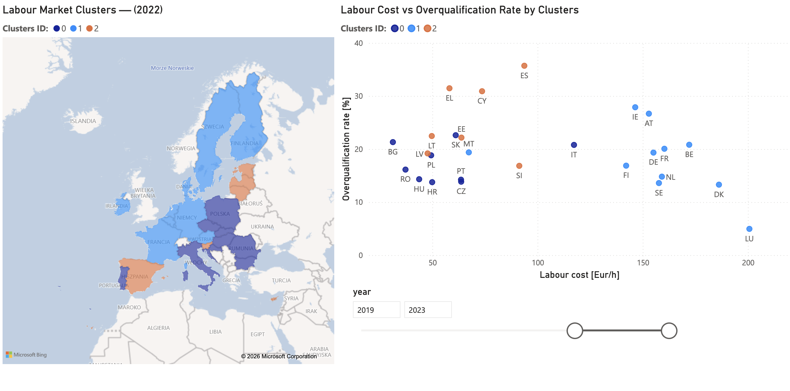
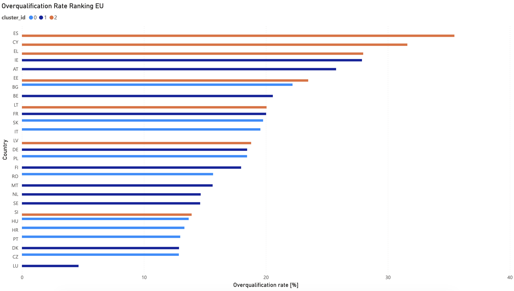
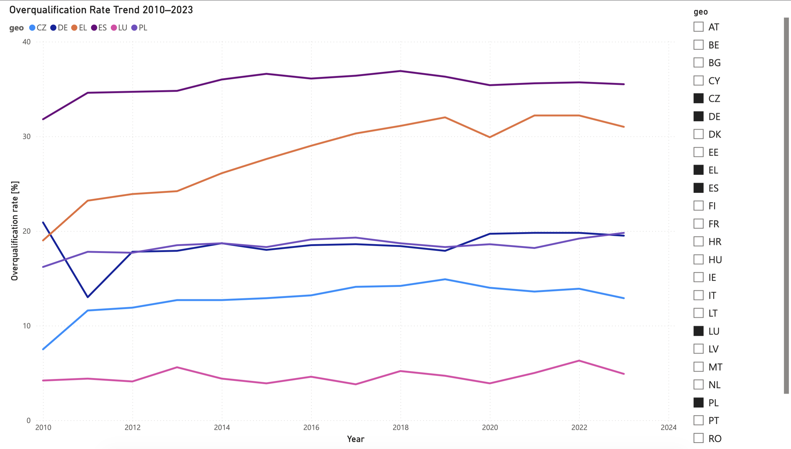

# Does a Degree Pay Off in Europe?
### Analysing overqualification, labour costs and education across EU27 countries

  

---

## Overview

Higher education is supposed to protect workers from low-skill jobs and translate into higher wages. But is that actually true across Europe?

This project combines four Eurostat datasets to segment EU27 countries by labour market profile using k-means clustering. The results reveal that **a country's wealth does not guarantee that a degree pays off** — Spain has a higher overqualification rate than Czechia despite being significantly richer.

**Research question:** Do countries with more university graduates have lower overqualification rates and higher labour costs — or does a degree paradoxically increase the risk of working below your qualifications?



---

## Key Findings

- **Southern trap** (ES, EL, CY) — overqualification rates of 30–36% despite average labour costs. High graduate supply, insufficient demand for skilled roles.
- **Degree pays off** (LU, DK, NL, DE) — lowest overqualification in EU27, highest labour costs. Labour market absorbs graduates and rewards them.
- **Central European outliers** (CZ, HU, SK) — low overqualification despite relatively low wages. Structural labour markets that match supply with demand efficiently.

---


## Datasets

All data sourced from [Eurostat](https://ec.europa.eu/eurostat), covering EU27 countries, 2010–2023.

| Dataset | Code | Description |
|---|---|---|
| Overqualification rate | `lfsa_eoqgan` | % of tertiary-educated workers in jobs below their qualification level |
| Labour cost | `lc_lci_lev` | Average hourly labour cost in EUR |
| Youth unemployment | `yth_empl_020` | Unemployment rate for ages 15–29 |
| Tertiary education | `edat_lfse_03` | % of population aged 25–64 with higher education |

---

## Dashboard Preview





**Page 1 — Overview:** EU27 cluster map + labour cost vs overqualification scatter plot, year slicer  
**Page 2 — Ranking:** Bar chart of overqualification rate by country, sorted descending, coloured by cluster  
**Page 3 — Trend:** Overqualification rate 2010–2023 with country slicer 

---

## Pipeline

```
Eurostat JSON API
      ↓
Python (fetch + clean)
      ↓
SQLite (4 tables + SQL view)
      ↓
k-Means Clustering (sklearn)
      ↓
Power BI Dashboard (3 pages)
```

---

## How to Run

```bash
# 1. Clone the repo
git clone https://github.com/FabianPietrzak/Does-degree-pay-off.git
cd Does-degree-pay-off

# 2. Create virtual environment
python -m venv .venv
.venv\Scripts\activate

# 3. Install dependencies
pip install -r requirements.txt

# 4. Run the pipeline (downloads data + builds DB + runs clustering)
python fetch_data.py

# 5. Open the notebook
jupyter notebook does_degree_pay_off.ipynb
```

The Power BI dashboard (`dashboard.pbix`) connects directly to `data/labour_market.db`.

---

## Requirements

```
requests
pandas
scikit-learn
matplotlib
seaborn
jupyter
```

---

## Tech Stack

- **Python** — data fetching, cleaning, clustering
- **SQLite** — lightweight relational storage, no server required
- **scikit-learn** — k-means clustering, standard scaling, median imputation
- **Power BI Desktop** — interactive dashboard with cross-filtering
- **PowerQuery** — data type transformations and locale handling